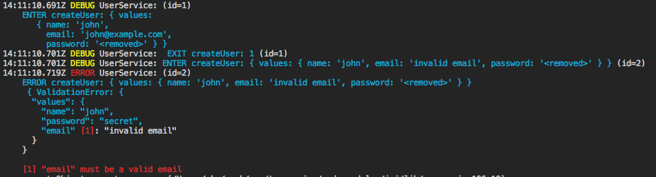
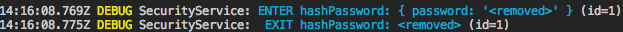

# ts-service
[](https://travis-ci.org/start-plus/ts-service)
[](https://codecov.io/gh/start-plus/ts-service)

ts-service is a TypeScript library for validation and logging.  
It depends on [joi](https://github.com/hapijs/joi) (validator) and [bunyan](https://github.com/trentm/node-bunyan) (logger)

## Installation

```
npm i ts-service
```

## Features
- Input logging (input parameters):
```
myService: ENTER methodName: {param1: 'foo', param2: 'bar'}
```
- Output logging (sync and async):
```
myService:  EXIT methodName: {result: 'foobar', anotherProp: 'bar'}
```
- Error logging with input parameters (see example below).
- Input validation and normalization (example: string type `"2"` to number type `2`).
```ts
add(
    @schema(Joi.number().required())
    a: number,
  ) {
    // `typeof a` will be always 'number'
    // even if we pass number string value e.g '2'
    // if the input is invalid (null, object, array etc) then an error will be thrown in runtime
  }
```
- Validation with inline annotation.
```ts
sendEmail(
  @schema(Joi.string().email().required()
  email: string
) {
  ...
}
```
- Validation with class annotation.
```ts
@schema(Joi.object().keys({....}))
class SendEmailValues {
  ...
}

sendEmail(values: SendEmailValues) {
  ...
}
```


## Example usage (inline annotation)
file `services/CalcService.ts`
```ts
import * as Joi from 'joi';
import { service, validate, schema } from 'ts-service';

@service
class CalcService {
  @validate
  add(
    @schema(Joi.number().required())
    a: number,
    @schema(Joi.number().required())
    b: number,
  ) {
    return a + b;
  }
}

// create your service
export const calcService = new CalcService();

```

use service
```ts
import {calcService} from './services/CalcService';


calcService.add(1, 3); // returns 4
calcService.add('5' as any, '6' as any); // returns 11, input parameters are converted to number types
calcService.add('1' as any, { foo: 'bar' } as any); // logs and throws an error
// NOTE: you shouldn't use casting `as any` in your code. It's used only for a demonstration purpose.
// The service is expected to be called with unknown input (for example: req.body).
```


See example under `example/example1.ts`. Run it using `npm run example1`.


## Async example usage (class annotation)
file `services/UserService.ts`
```ts
import * as Joi from 'joi';
import { service, validate, schema } from 'ts-service';

@schema(
  Joi.object().keys({
    name: Joi.string()
      .required()
      .alphanum(),
    email: Joi.string()
      .required()
      .email(),
    password: Joi.string()
      .required()
      .min(5),
  }),
)
class CreateUserValues {
  name: string;
  email: string;
  password: string;
}

@service
class UserService {
  @validate
  async createUser(values: CreateUserValues) {
    const id = 1;
    return id;
  }
}

// create your service
export const userService = new UserService();

```

use service
```ts
import {userService} from './services/UserService';

await userService.createUser({
  name: 'john',
  email: 'john@example.com',
  password: 'secret',
}); // ok
await userService.createUser({
  name: 'john',
  email: 'invalid email',
  password: 'secret',
}); // throws an error
```



See example under `example/example2.ts`. Run it using `npm run example2`.  


## Removing security information
By default properties `password`, `token`, `accessToken` are removed from logging.  
Additionally you can annotated method with `@removeOutput` to remove the method result.  
Example:

file `services/SecurityService.ts`
```ts
import * as Joi from 'joi';
import { service, validate, schema, removeOutput } from 'ts-service';

@service
class SecurityService {
  @validate
  @removeOutput
  hashPassword(
    @schema(Joi.string().required())
    password: string,
  ) {
    return 'ba817ef716'; // hash password here
  }
}

// create your service
export const securityService = new SecurityService();

```

use service
```ts
import {securityService} from './services/SecurityService';

securityService.hashPassword('secret-password');
```



See example under `example/example3.ts`. Run it using `npm run example3`.


## Configuration
```ts
import {configure} from 'ts-service';

configure({
  removeFields: string[], // the array of fields not won't be logged to the console, default: ['password', 'token', 'accessToken'],
  debug: boolean,         // the flag if ENTER and EXIT logging is enabled, (errors are always enabled), default: true
  depth: number,          // the object depth level when serializing, default: 4           
  maxArrayLength: number, // the maximum number of elements to include when formatting an array, default: 30  
})
```

You must configure it, before creating any service.

## Special properties
if the parameter name is `req` it's assumed that the object is an express request.  
Only properties are logged: `method`, `url`, `headers`, `remoteAddress`, `remotePort`.  


if the parameter name is `res` it's assumed that the object is an express response.  
Only properties are logged: `statusCode`, `header`.  


MIT License